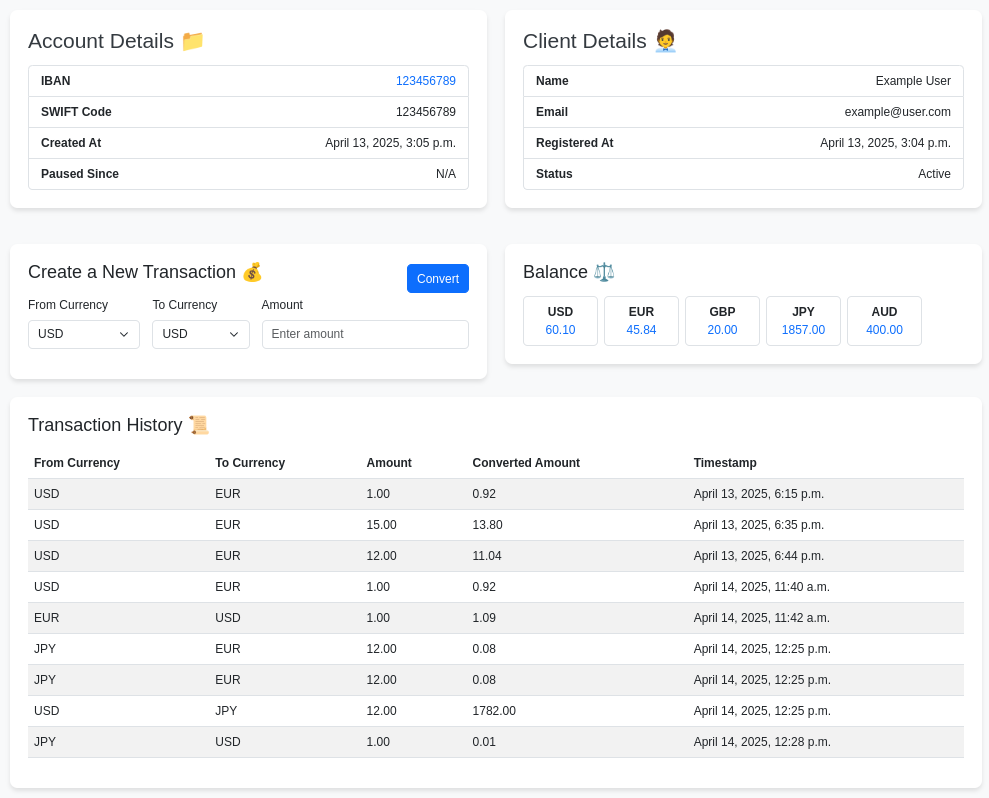

# Ebury Clone - Multicurrency Platform

Welcome to my personal refactor of the [Digital Solutions](https://github.com/MarkosHB/Digital-Solutions) proposal. This time, I will be using Django to create a web-based application that allows users to manage accounts, perform currency conversions, and track transaction histories.

### Features

- **Account Management**: View account details, balances, and transaction history.
- **Currency Conversion**: Convert between multiple currencies with real-time rates.
- **Transaction Tracking**: Keep a detailed history of all currency conversions.
- **User-Friendly Interface**: A clean and responsive design for easy navigation.

---

### Technologies Used


- **Python**: Backend logic and server-side processing.
- **Django**: Web framework for rapid development and clean design.
- **SQLite**: Lightweight database for storing user and transaction data.
- **Bootstrap**: Frontend framework for responsive and modern UI design.
- **JavaScript**: Dynamic interactions and client-side logic.
- **HTML/CSS**: Structure and styling of the web pages.

---

### User Homepage Details


Take a look at more [images](images/) of the admin site.

---

## Setup Instructions

1. Clone the repository:
   ```bash
   git clone <repository-url>
   ```

2. Navigate to the project directory:
   ```bash
   cd Ebury-Clone-Multicurrency-Platform
   ```

3. Create and activate a virtual environment:
   ```bash
   python3 -m venv .venv
   source .venv/bin/activate
   ```

4. Install dependencies:
   ```bash
   pip install -r requirements.txt
   ```

5. Change directory into the app:
   ```bash
   cd project
   ```

6. Run the development server:
   ```bash
   python manage.py runserver
   ```

---

### Check out the results

Open your browser and navigate to:
   ```
   http://127.0.0.1:8000/
   ```

See how the administration site is build:
   ```
   http://127.0.0.1:8000/admin
   ```

The database comes preloaded with the following users.
You can use these credentials to log in and explore the platform.

- **Admin User**
  - Username: `admin`
  - Password: `admin`

- **Regular User**
  - Username: `example`
  - Password: `exampleuser`
